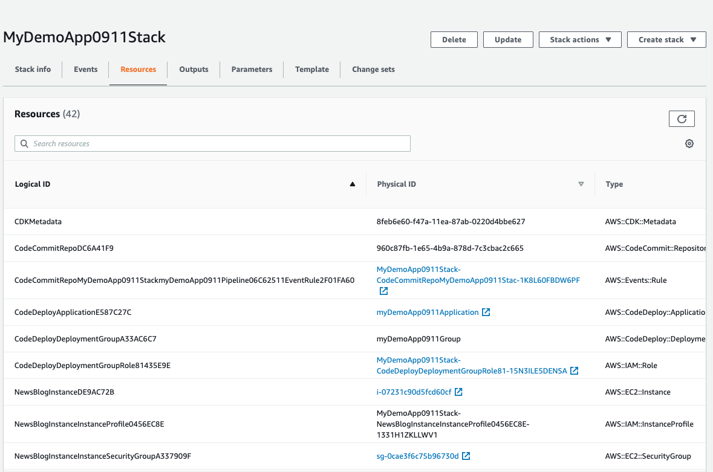
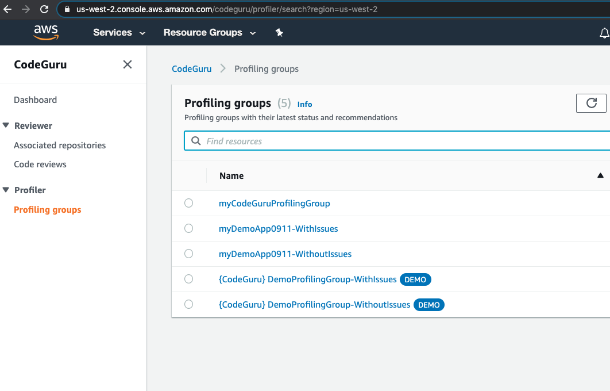
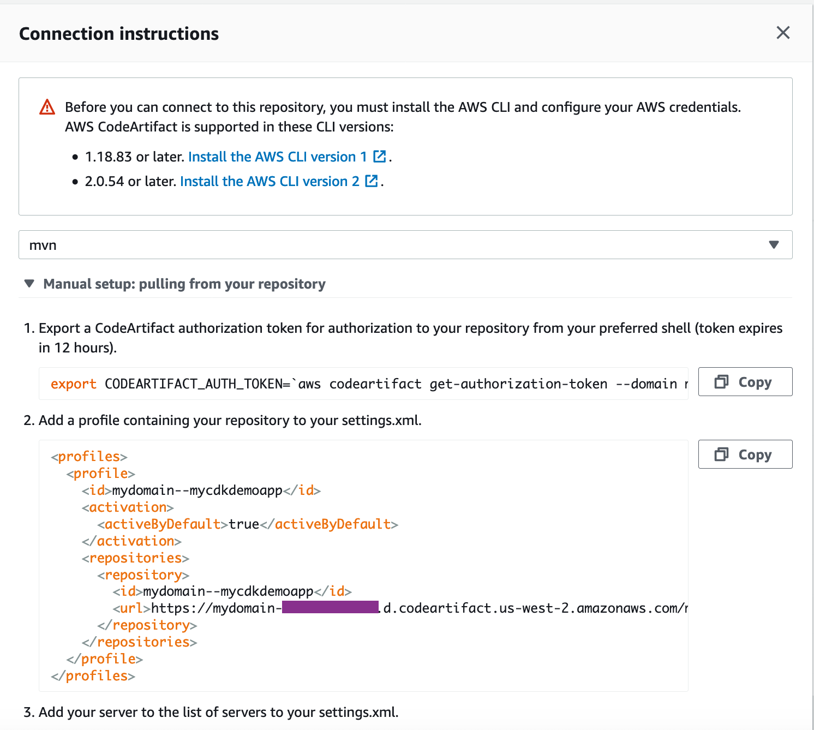
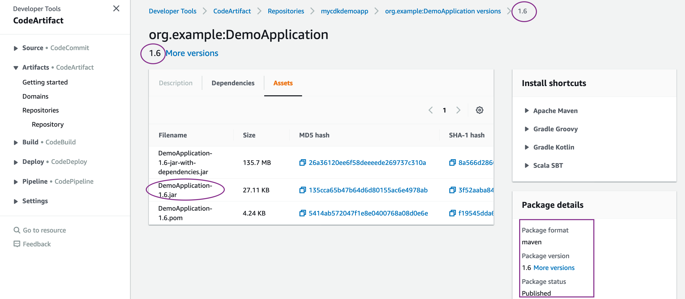
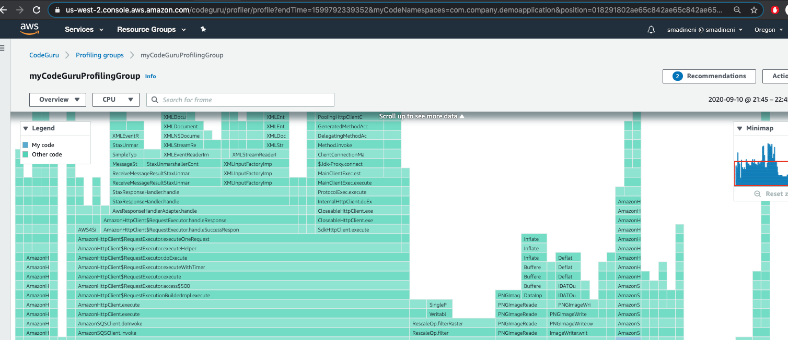
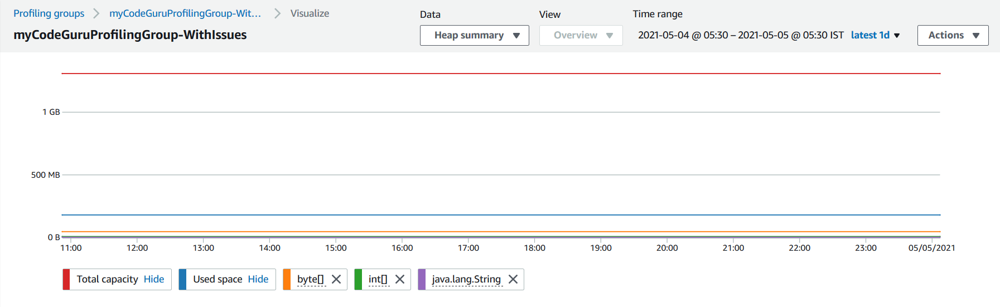
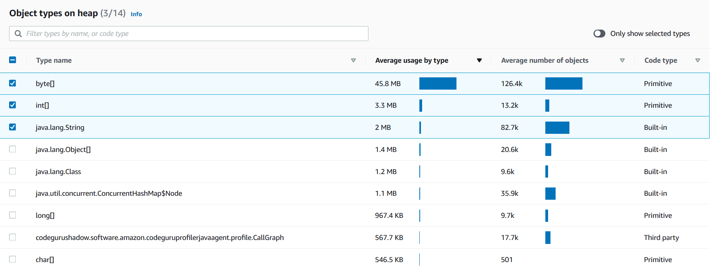

### Procedure to follow:

<b>Step1. Cloud9 and commands to run:</b>

First launch a Cloud9 terminal and prepare it with following commands:

```bash
sudo yum install -y jq
export ACCOUNT_ID=$(aws sts get-caller-identity --output text --query Account)
export AWS_REGION=$(curl -s 169.254.169.254/latest/dynamic/instance-identity/document | jq -r '.region')
echo "export ACCOUNT_ID=${ACCOUNT_ID}" | tee -a ~/.bash_profile
echo "export AWS_REGION=${AWS_REGION}" | tee -a ~/.bash_profile
aws configure set default.region ${AWS_REGION}
aws configure get default.region
```
Ensure the Cloud9 is assigned a role of an administrator and from Cloud9 -> AWS Settings -> Credentials -> Disable the Temporary Credentials

Prepare CDK prerequisite:

```bash
sudo yum install -y npm
npm install -g aws-cdk
npm install -g typescript@latest
```
Run git clone on this repository from Cloud9:

```bash
git clone https://github.com/aws-samples/building-java-apps-using-code-pipeline.git codeGuruDemoApp
```

Once cloned, run the below commands:

```bash
cd codeGuruDemoApp
```

Note: For this workshop, we are using CDK version 1.58.0. If using the latest CDK version using "npm install -g aws-cdk" (without a version specification) then you would need to modify the EKS construct to include version number too.


```bash
git init
git add .
git commit -m "Initial Commit"
git status
git log
```
Now run the CDK steps as below:

```bash
cd cdk
cdk init
npm install
npm run build
cdk ls
```

Ensure the output is CdkStackEksALBBg

```bash
cdk synth
cdk bootstrap aws://$ACCOUNT_ID/$AWS_REGION
cdk deploy
```

You may be asked to confirm the creation of the roles and authorization before the CloudFormation is executed, for which, you can respond with a “Y”.

The infrastructure will take some time to be created, please wait until you see the Output of CloudFormation printed on the terminal. Until then, take time to review the CDK code in the below file: cdk/lib/cdk-stack.ts

You may also check and compare the CloudFormation Template created from this CDK stack:
cdk/cdk.out/CdkStackJavaApp.template.json

Navigate to the cloudformation console, and find your stack and look at the newly created resources.




<b> Step2: CodeGuru setup :</b>


<b>Configuring CodeGuru REVIEWER:</b>
First we will associate the codecommit repository with CodeGuru service and verify in the listing output:

```
aws codeguru-reviewer associate-repository --repository CodeCommit={Name=CdkStackJavaApp-repo} 
aws codeguru-reviewer list-repository-associations 
```

Note down the ARN from the listing output above and replace that in the CodeBuild project buildspec lines:

```
aws codeguru-reviewer create-code-review --name mycodereview$TAG --repository-association-arn <ARN> --type RepositoryAnalysis={RepositoryHead={BranchName=main}}
```

Now navigate to the Build Details -> Environment -> Locate the service role -> Assign this IAM role with permissions for full access to CodeGuru: AmazonCodeGuruReviewerFullAccess

<b>Configuring CodeGuru Profiler:</b>
Create a profiling groups in CodeGuru Profiler, named `myCodeGuruProfilingGroup-WithIssues`

```
aws codeguruprofiler create-profiling-group --profiling-group-name myCodeGuruProfilingGroup-WithIssues

```

You may navigate to the AWS console and look at the newly created profiling group by choosing CodeGuru Profiler in the Getting started section.




<b> Step3: CodePipeline repository setup :</b>

Modify the origin of the demo repo to point to the newly created code commit repo. 

```
cd /home/ec2-user/environment/codeGuruDemoApp
git remote set-url origin https://git-codecommit.$AWS_REGION.amazonaws.com/v1/repos/CdkStackJavaApp-repo
git remote -v
git branch -m main
git branch
```

<b> Step4: Code Artifact setup :</b>


1. Create the CodeArtifact domain

`aws codeartifact create-domain --domain mydomain`

2. Create the CodeArtifact repository to store the Maven artifacts

`aws codeartifact create-repository --domain mydomain --repository mycdkdemoapp --description "My CDK demo Repo"`

Now associate the repository with public maven central repository:

`aws codeartifact associate-external-connection --domain mydomain --repository mycdkdemoapp --external-connection public:maven-central`

3. Ensure the codebuild artifact env variable CODEARTIFACT_AUTH_TOKEN is setup appropriately corresponding to your repo. name

4. Modify the settings.xml profiles, mirrors and servers in the git repository

* Navigate to AWS console corresponding to the code artifact repository and click `View connection instructions` and select `mvn` as the package manager client



* Replace the profiles section, servers section and mirrors section in settings.xml with these values.

This is how a sample setting.xml file should look like (replace ACCT-ID and REGION)

```xml
<settings xmlns="http://maven.apache.org/SETTINGS/1.0.0"
          xmlns:xsi="http://www.w3.org/2001/XMLSchema-instance"
          xsi:schemaLocation="http://maven.apache.org/SETTINGS/1.0.0 http://maven.apache.org/xsd/settings-1.0.0.xsd">

  <servers>
    <server>
      <id>mydomain--mycdkdemoapp</id>
      <username>aws</username>
      <password>${env.CODEARTIFACT_AUTH_TOKEN}</password>
    </server>
  </servers>
  
  <mirrors>
    <mirror>
      <id>mydomain--mycdkdemoapp</id>
      <name>mydomain--mycdkdemoapp</name>
      <url>https://mydomain-<ACCT-ID>.d.codeartifact.<REGION>.amazonaws.com/maven/mycdkdemoapp/</url>
      <mirrorOf>*</mirrorOf>
    </mirror>
  </mirrors>

  <profiles>
    <profile>
      <id>mydomain--mycdkdemoapp</id>
      <activation>
        <activeByDefault>true</activeByDefault>
      </activation>
      <repositories>
        <repository>
          <id>mydomain--mycdkdemoapp</id>
          <url>https://mydomain-<ACCT-ID>.d.codeartifact.<REGION>.amazonaws.com/maven/mycdkdemoapp/</url>
        </repository>
      </repositories>
    </profile>
  </profiles>
</settings>
```

5. Modify the pom.xml and distribution management section, from the code artifact connection instructions
Example below (replace ACCT-ID and REGION)

```xml
    <distributionManagement>
      <repository>
        <id>mydomain--mycdkdemoapp</id>
        <name>mydomain--mycdkdemoapp</name>
        <url>https://mydomain-<ACCT-ID>.d.codeartifact.<REGION>.amazonaws.com/maven/mycdkdemoapp/</url>
      </repository>
    </distributionManagement>
```


6. Modify the DEMO_APP_BUCKET_NAME, AWS_CODEGURU_TARGET_REGION, DEMO_APP_SQS_URL and AWS_CODEGURU_PROFILER_GROUP_NAME environment variables in scripts/start.sh

```bash
export DEMO_APP_BUCKET_NAME=<Found in CloudFormation resources that is not CodePipeline artifact bucket>
export AWS_CODEGURU_TARGET_REGION=<REGION>
export DEMO_APP_SQS_URL=<http link found in CloudFormation resources>
export AWS_CODEGURU_PROFILER_GROUP_NAME=myCodeGuruProfilingGroup-WithIssues
```
Also modify the line containing "alias javacmd=" with the updated profiling group name.

Now update the file scripts/install.sh with the updated domain, repo and region.

```bash
aws codeartifact get-package-version-asset --region=<REGION> --domain mydomain --repository mycdkdemoapp --format maven --package DemoApplication --namespace org.example --package-version 1.6 --asset DemoApplication-1.6-jar-with-dependencies.jar /home/ec2-user/server/demoapplication.jar > /tmp/demooutput 2>&1
```

7. Modify the CodeBuild project to update the CODEARTIFACT_AUTH_TOKEN
Ensure the package version is the same across script/install.sh and pom.xml files and unique (not existing in CodeArtifact)

8. Push your changes to codecommit and that will trigger the codepipeline for deployment

```bash
git add scripts/install.sh
git add scripts/start.sh
git add settings.xml
git add pom.xml
git commit -m "Updating the CodeDeploy scripts, settings.xml and pom.xml files"
git push origin main
```

This will kickstart the codepipeline, wait for all stages to complete.
Later after CodeDeploy completes the deployment, wait for around 15 mins for the Profiling Group to start profiling.

Note: The package version referred to here is 1.6 to begin with. If need to re-run the CodePipeline, you would need to update the pom.xml and scripts/install.sh to update the version numbers to next one and then push the new changes to kick-off the pipeline. Without that, publishing the new java artifact to CodeArtifact will fail as the same package version exists.

# Validate the setup

1. Navigate to CodePipeline console and check if the pipeline execution is successful

2. Check the version present in CodeArtifact



3. Navigate to CodeGuru profiler section and check the newly created profing group. There should be some reports in 10-15 minutes.



4. Navigate to CodeGuru Profiler section and check "Heap Usage" report. There should be some reports in 10-25 minutes.




